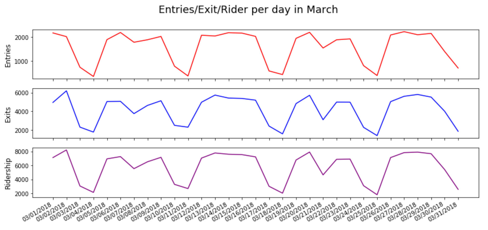
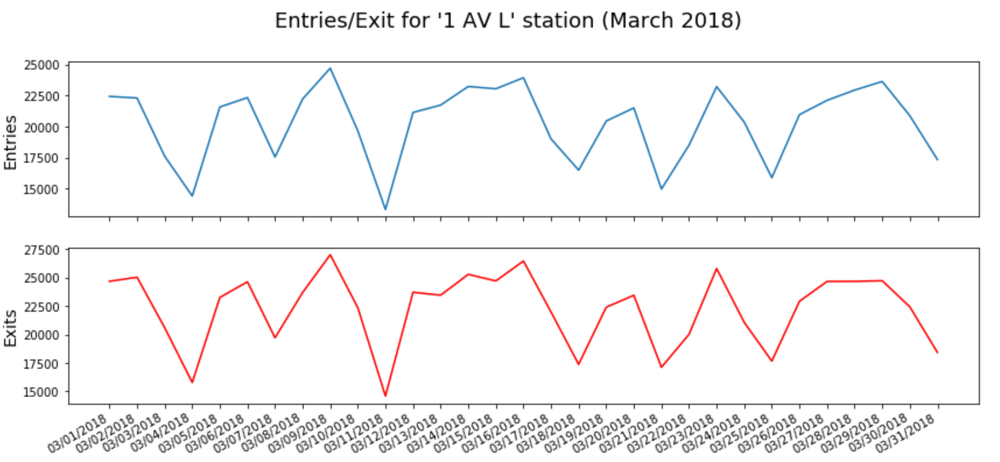
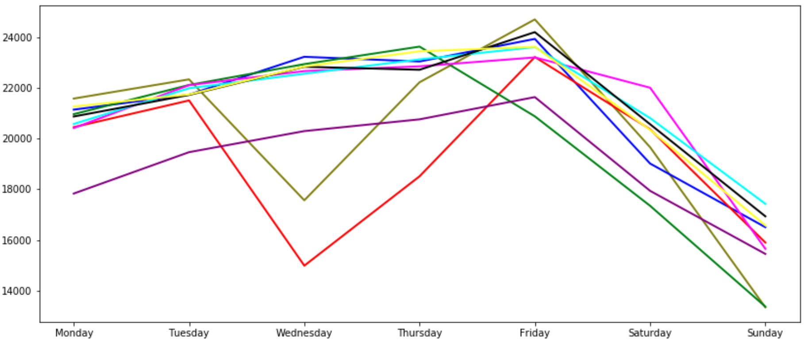
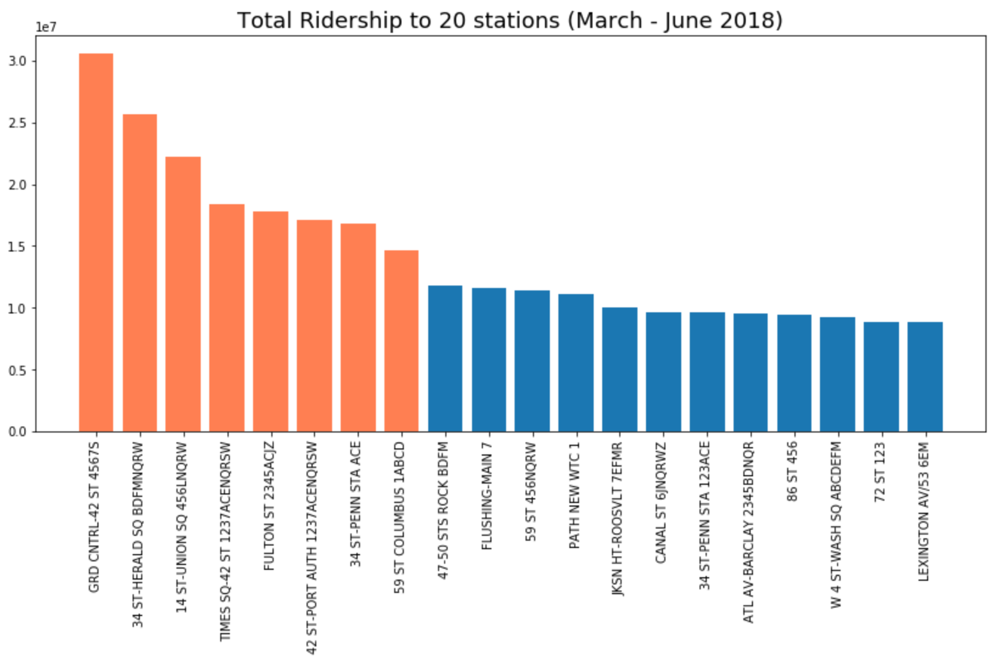

### Benson Challenge Report

#### Challenge 1 - Getting data
For this first challenge, I downloaded several turnstile files from the MTA website.  I then created two scripts, the first to read the local files and the second to read off the MTA website.  In particular, I chose only data from 2015-2018, because from 2014-2015 the file format was changed pretty significantly.

#### Challenge 2 & 3 - Cleaning and formatting data
I saw these challenges as primarily a task of cleaning the data.  Here is a quick list of what I did:  

* I declared my own column names according to MTA help file (this allowed me not to waste time cleaning or changing names)  
* For time series, I turned `date` and `time` into `date_time`  
* Initially, I also dropped a lot of timestamps.  While, I later dropped this in order to finish deliverable, I thought this was an important step, thus code remains in Jupyter notebook file.  Since turnstile data is collected every 4 hours, a quick check revealed that the 4 6 hour-cycle times (12, 1, 2, 3am) contain most of the rider data.  Without filtering, there are thousands of unique timestamps.
* `lines` had a problem that was resolved by simply sorting each entry with a lambda function.
* Also found that `stations` only had ~360 values, while a quick Google search stated that MTA had 472 stations. To resolve this, I tried combining `station` and sorted `lines_sorted` to create new category `station_line`.  This gave me ~460 'stations', a drastic improvement.  
* Finally, I organized turnstile data by net entry/exit.  Each turnstile collects cumulative totals, but the real problem is that there are excessively large values AND negative values.  For the negative values, I assumed the turnstile reversed signs, and for the values exceeding 7000, I dropped those results.  A value of 7000 suggests that the single turnstile had roughly 1 person pass through every 2 seconds for a whole 4 hours, which seemed pretty unreasonable.

#### Challenge 4 - Plot daily entries for a single turnstile
For added understanding, I presented 3 graphs here, one for entries, one for exits, and one for total ridership (entries+exits).  

As can be seen, results are fairly predictable, with consistent dips in weekends.  Notably, there are two dips in weekdays on the 7 and 21, both of which were days where there was winter storms.  This will come back up again in a later graph.

#### Challenge 5 Combining turnstile data by C/A, UNIT, and STATION

For this challenge, I took a single turnstile defined by `control`,`unit`, and `scp` from Grand Station.  In a previous iteration of this part of my code, I had narrowed down my results through time stamps, which was an inefficient method since I had to manually view the time stamps to know whether I had the right data or not.

#### Challenge 6 Combining data by STATION

While the challenge here was to combine station data by `station`, this didn't make sense for the reasons I had mentioned in my 5th bullet point for *Challenge 2 & 3*, which is the number of stations did not even remotely match the MTA's list.  Thus, I completed the task using `station-line`.

#### Challenge 7 Plot a single station's data

Rather than using Grand Central Station, which I had used for the turnstile challenge, I chose to use the station-line, 1 AV L.  To be completely transparent, this was also because it was the first station that popped up when I displayed my data frame and thus made an index slice the easiest.  I only plotted entries and exits here and again only did March 2018.  The primary reason I chose to only do March data for the turnstile and station challenge is because adding in April-June did not add any value and only made the graphs less understandable by adding 12 humps.  By just doing one month, I think all the behavior that can be captured visually already shows up.

#### Challenge 8 Plot a week-by-week data

For this challenge, I went ahead and added in April data as well.  The primary reason is that March only consisted of 4 lines, 2 of which were affected by large winter storms that hit NYC March 2018.  By seeing both months, you can see a strong consistency in ridership behavior.  The purple line which is a bit lower is likely due to Spring Break.

#### Challenge 9 & 10
I completed this task with a bar plot that displays the top 20 station lines ranked by traffic from March 18 through June 2018.  As an added bonus, I highlighted the top 8 by displaying them in coral, rather than default blue.  

A primary concern of mine as I was using this table is that I did not limit my ridership counts to weekday ridership.  In the scope of the original Benson project, we are informed that the target audience includes locals and students, both of whom use public transportation most on weekdays.  By including ridership data of weekends, I potentially list stations that have high ridership as a result of tourism. 

